<!--
  ┌────────────────────────────────────────────────────────────────┐
  │  GitHub PROFILE README.                                        │
  │  Lives in a repo named exactly:  Apoorvan-A/Apoorvan-A         │
  │  See SETUP.md for the push + snake-animation instructions.     │
  └────────────────────────────────────────────────────────────────┘
-->

  
  
  
  

  

---

### 👋 About

I'm a **final-year CSE undergraduate at VIT Vellore** (CGPA **9.16/10.0**, graduating 2027) who likes the parts of software where latency, correctness, and scale actually matter. I've shipped an **event-driven fraud-scoring service at 1,275 tx/s (70 ms p99)** and a **leakage-free cloud-CPU forecasting benchmark across 7 models** — and I care as much about the load test and the CI gate as the feature itself.

- 🧠 **Strong in** → Python backend engineering, low-latency distributed systems, applied ML/LLM
- 💼 **Recently** → Software Engineering Intern @ **Ramco Systems** — async FastAPI services behind an enterprise LLM chatbot
- 🎯 **Targeting** → Backend · Systems · AI-ML Software Engineering roles
- 📍 Salem, Tamil Nadu, India

---

### ⚡ Signature system — Real-Time Fraud Scoring

  

Ingestion decoupled from scoring via <b>Redis Streams</b> + an async consumer-group worker pool over <b>FastAPI</b> &amp; <b>PostgreSQL</b>. Feature lookups moved to an O(1) Redis store (atomic Lua) for a <b>4.7× throughput</b> gain. → <a href="https://github.com/Apoorvan-A/Fraud-Detection">See the code</a>

---

### 🛠️ Tech I build with

  

<b>Backend / Infra</b> · FastAPI · Flask · REST · WebSockets · Redis Streams · PostgreSQL · Docker · GitHub Actions · AWS (EC2 / API Gateway / CloudWatch) · k6 
<b>AI / ML / LLM</b> · PyTorch · TensorFlow · scikit-learn · XGBoost · Transformers · CNNs · OpenCV · LLM / RAG · XAI (SHAP · Grad-CAM) · pandas · NumPy

---

### 🚀 Featured Projects

<table>
<tr>
<td width="50%" valign="top">

#### 🛡️ [Real-Time Fraud Detection](https://github.com/Apoorvan-A/Fraud-Detection)
**Event-driven fraud-scoring service.** `FastAPI · Redis Streams · PostgreSQL · Docker · k6`

- ⚡ **1,275 tx/s @ p99 70 ms**, zero consumer backlog (k6)
- 🚀 **4.7× feature-lookup throughput** (770 → 3,634 ops/s; p99 48 → 10 ms) via an O(1) Redis store + atomic Lua
- 🧱 CI-gated tests, one-command Docker deploy, live **WebSocket** dashboard
- 🤖 Async LLM (Gemini) explainability with off-hot-path fallback — an LLM outage never blocks a decision

</td>
<td width="50%" valign="top">

#### ☁️ [CloudSense](https://github.com/Apoorvan-A/CloudSense_v2)
**Predictive cloud-resource analytics.** `PyTorch · FastAPI · Docker · AWS`

- 📈 4-hour CPU forecasting, **R² 0.73 / MAE 5.7%**, zero train/serve skew
- 🐞 Diagnosed & killed a data-leakage bug (**R² −1.7 → 0.70**)
- 🔬 Reproducible **7-model benchmark** (CEEMDAN+CNN-BiLSTM, Transformer, LSTM…) on real AWS/Numenta NAB telemetry, GitHub Actions CI

</td>
</tr>
<tr>
<td width="50%" valign="top">

#### 🌾 [AgroGuard](https://github.com/Apoorvan-A/Agrogaurd)
**Multimodal AI for precision agriculture.** `TensorFlow · XGBoost · SHAP · OpenCV · Streamlit`

- 🌿 **MobileNetV2** plant-disease detection (15 classes, Grad-CAM)
- 🌱 **XGBoost** soil-based crop recommendation across 22 crops
- 🔍 Production model chosen from **8 algorithms** (5-fold CV) + SHAP/Grad-CAM explainability

</td>
<td width="50%" valign="top">

#### 🧩 [Assemble](https://github.com/Apoorvan-A/assemble)
**Full-stack platform for hackathon teams.** `React · TypeScript · Flask · Socket.IO`

- 💬 Real-time chat & notifications over WebSockets
- 🔐 JWT + GitHub/Google OAuth, rate-limited API
- 🤖 In-app AI assistant grounded in live platform data

</td>
</tr>
</table>

---

### 📊 GitHub in numbers

  
  

<!-- Animated contribution snake — generated by a GitHub Action (see SETUP.md, Part 4) -->
<picture>
  <source media="(prefers-color-scheme: dark)" srcset="https://raw.githubusercontent.com/Apoorvan-A/Apoorvan-A/output/snake-dark.svg"/>
  <source media="(prefers-color-scheme: light)" srcset="https://raw.githubusercontent.com/Apoorvan-A/Apoorvan-A/output/snake.svg"/>
  
</picture>

---

### 🏆 Achievements & Certifications

- 🥈 **Google GDSC DevJams '24** — penultimate round with *Vipool* carpooling platform, vs **120+ teams** (top 15% of CSE cohort)
- ☁️ **Oracle Cloud Infrastructure 2024 Generative AI Certified Professional** — LLM fundamentals, prompt engineering, RAG
- 🎓 **Supervised Machine Learning: Regression & Classification** — Andrew Ng / DeepLearning.AI (Coursera)

---

💡 <em>"I care about the load test as much as the feature."</em> &nbsp;·&nbsp; Let's build something that holds up under traffic.

